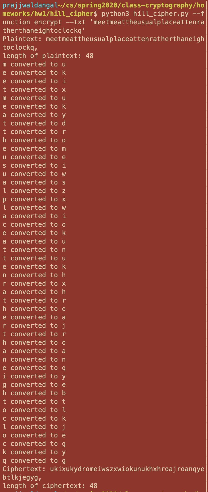

# cryptography-algorithms
Contains implementation of some common algorithms that are used in cryptography.

1. Hill cipher: is a polyalphabetic cipher as the same character in the plaintext can be mapped to two different characters in
                the ciphertext. Hill cipher works through the use of a key, K which is in the form of a matrix of dimension
                m x m. K is said to be of length m. Encryption is carried out as:
                C = KP where ciphertext C is obtained through matrix multiplication of key K and plaintext P.
                
                Hill cipher is quite secure as it is less prone to frequency analysis of characters.
Following is the encryption program for Hill Cipher. This python program takes plaintext argument and encrypts the plaintext
according to a 2x2 matrix [[9, 4], 
                           [5, 7]].

