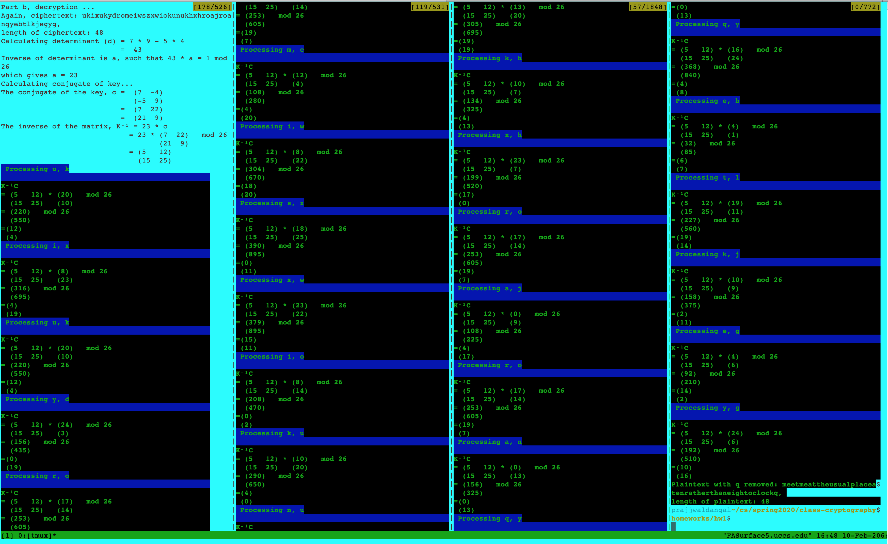
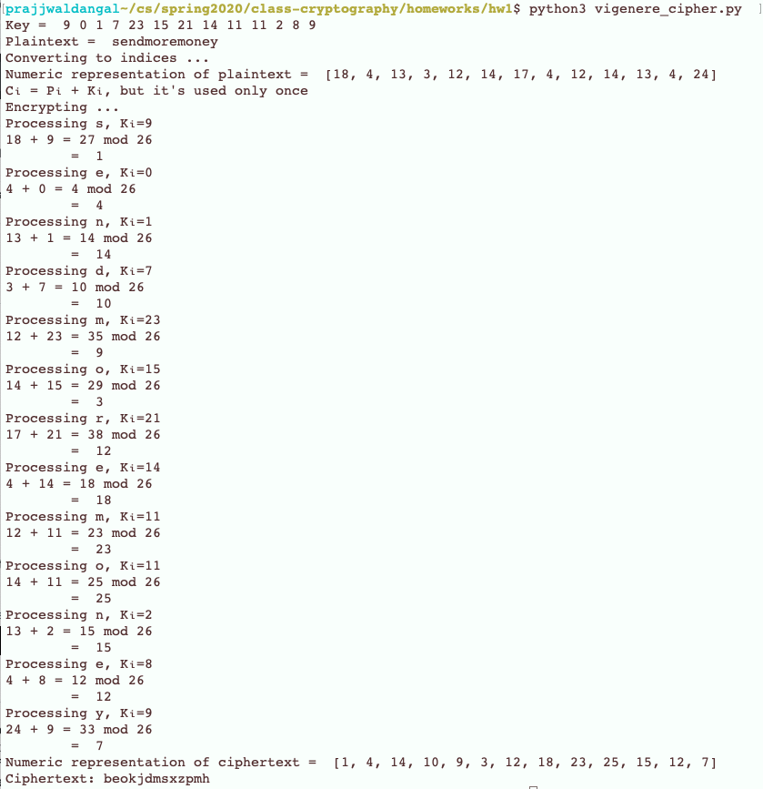
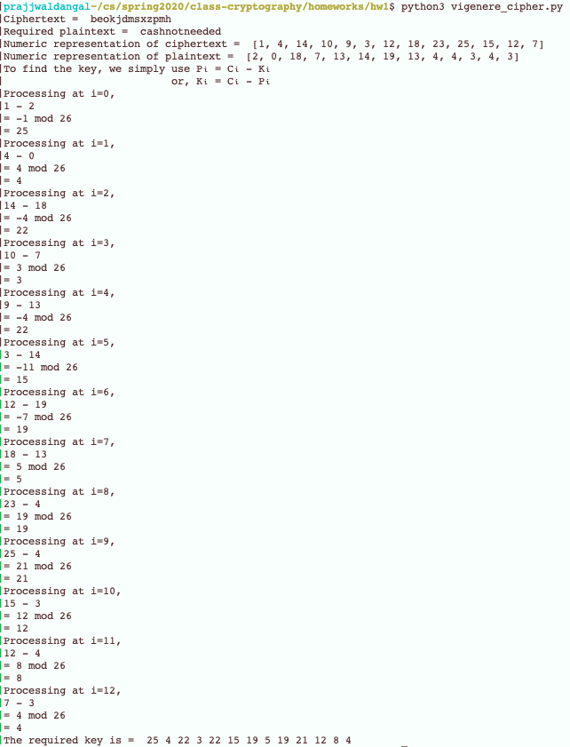

# Cryptography Algorithms
Contains implementation of some common algorithms that are used in cryptography.

1. Hill cipher: is a polyalphabetic cipher as the same character in the plaintext can be mapped to two different characters in
                the ciphertext. Hill cipher works through the use of a key, K which is in the form of a matrix of dimension
                m x m. K is said to be of length m. Encryption is carried out as:
                C = KP mod 26 where ciphertext C is obtained through matrix multiplication of key K and plaintext P.
                
                Hill cipher is quite secure as it is less prone to frequency analysis of characters.
  Following is the encryption program for Hill Cipher. This python program takes plaintext argument and encrypts the plaintext
  according to a 2x2 matrix [[9, 4], 
                             [5, 7]].
                             
  

  Following is the decryption program for Hill Cipher. This python program takes ciphertext argument and decrypts the plaintext
  based on the inverse of the above mentioned matrix [[9, 4], 
                                                      [5, 7]].
                                                    
  
  
2. Vigenere cipher: is also a polyalphabetic cipher that uses a key (of length m) repeated over the length of the plaintext. In 
                    Vigenere cipher, Ci = Kj + Pi mod 26, where 0 <= i <= length of the plaintext, j = i mod m, K is the key, C 
                    is the ciphertext and P is the plaintext.
                    
                    Vigenere cipher is secure in that other versions of Vigenere ciphers like the one-time pad (OTP) are robust
                    against brute-force attack to a great extent.

    Following is the encryption program for one-time pad. This python program encrypts the plaintext: "sendmoremoney" using 
    the key, [9 0 1 7 23 15 21 14 11 11 2 8 9].
    
    
    Following is the decryption program for the ciphertext from above but the objective here is to calculate the key that 
    yields the plaintext, "cashnotneeded".
    
